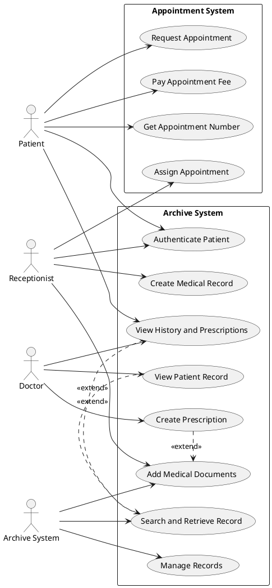
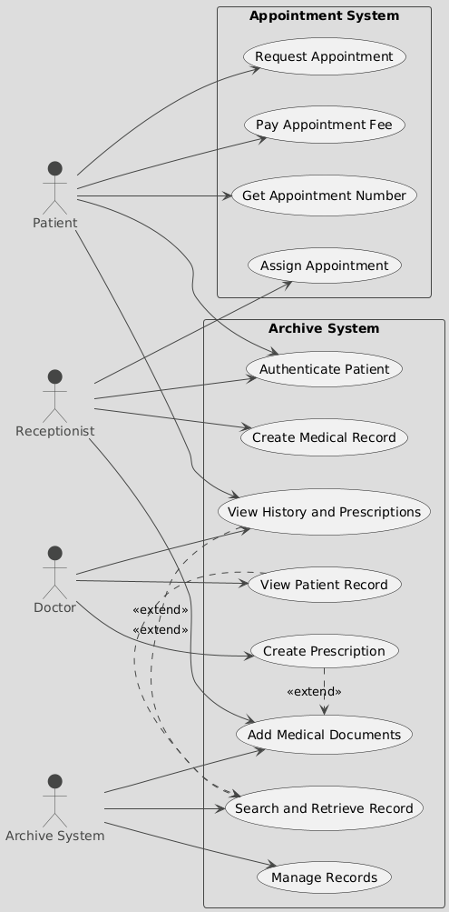

# Medical Clinic System

A prototype web-based system for managing a medical clinic, including appointment scheduling, patient record management, and prescription handling. This project includes a Use Case diagram and a UI mockup.

## Use Cases
The system supports the following actors and their use cases:

### Patient
- **Request Appointment**: Select a doctor and date to book an appointment.
- **Pay Appointment Fee**: Pay the appointment fee online.
- **Get Appointment Number**: Receive a unique appointment number.
- **Authenticate**: Log in using national ID and password.
- **View History and Prescriptions**: Access medical history and prescriptions.

### Receptionist
- **Assign Appointment**: Schedule appointments for patients.
- **Create Medical Record**: Create a patient record with a unique archive code.
- **Authenticate Patient**: Verify patient identity.
- **Add Medical Documents**: Upload medical documents to patient records.

### Doctor
- **View Patient Record**: Access patient records using archive code.
- **Create Prescription**: Write and save prescriptions in patient records.
- **View History and Prescriptions**: Review patient medical history.

### Archive System
- **Manage Records**: Store and organize patient records.
- **Search and Retrieve Record**: Retrieve records by archive code.
- **Add Medical Documents**: Append documents to existing records.

## Use Case Diagram
The following PlantUML code defines the Use Case diagram for the system:



To view the rendered diagram, paste the code into [PlantUML Online](https://www.plantuml.com/plantuml/uml/XPJDRjGm4CVlVefHBtig3u2gLQlomQLenGgkQ726hDN42VQai49zT-mui_9G8qw9vl__PJuozcra3BoCWndeEmDF45n_OkXS8CjkyYO-EZzZm15cj8_Oqv7F0q6MqVS36OEMfm1N1sH7dgy08spl8hsPydDLogi8dyZIdDEuMC0w8AQxO4_kYU1uZapZQjj29MBCLbcoplFaF8_a-MB_RG2MI1OZvOG_5eeCOfI2Fzz_tQHAgS43dci8tX49cAH_GE-95VHn6RzH42wf9L0ZTp6wthVgAqgTwRdkN0z9TtqV29dWWJfdSSX3da8dtotYnjVK5qS_vK_-nMH94IhF8L2qmQt_KMUf5TLrrqbrUKEMt5uKD8cNc88MFgLOWfYaJc4gxMLF7rpaAPm1VQTgZNLxcwc67z1ZJzieBkOIRKpZI9Y2EKj2E3Xw4bRGuX3qsPZTPTxECmMqQrb6WjVN-_QcQeTUIQtgnTE2dfhMr4pCJXrKNQnI2jpOtPPBRQ9oD0fi6zIkcDrstUW2IwmGQfMLqbnPCJH7ee-WpgakBE7LvhGjiY5jIxFbjx-OV0U11bnpdzmSZMuKNhtyEBo6cnjQsVtUwEx-xs-Egs2gG4sPs_HSnk4F) or use a PlantUML-compatible tool.

## Getting Started
1. **Clone the Repository**:
   ```bash
   git clone <repository-url>
   ```
2. **Open the Project**:
    - Open `index.html` in a browser to view the UI mockup.
    - Use WebStorm or a PlantUML-compatible tool to render `clinic-usecase.puml`.
3. **Requirements**:
    - Internet connection for Tailwind CSS CDN.
    - PlantUML plugin (for WebStorm) or online PlantUML renderer.

## Technologies
- **HTML/CSS**: UI mockup with Tailwind CSS.
- **JavaScript**: Basic form handling.
- **PlantUML**: Use Case diagram.

## License
MIT License