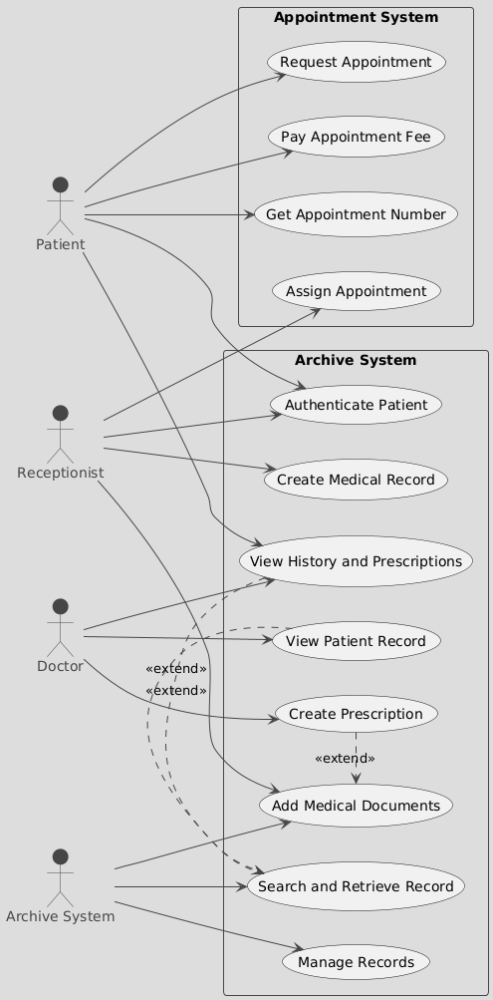

# Medical Clinic System – Use Case UI

A structured prototype UI and system design project for a medical clinic management platform.

This repository demonstrates clinical workflows and backend-oriented system architecture through interactive UI components, PlantUML diagrams, and healthcare-related use case modeling.

The project is designed to simulate real-world clinic operations including appointment management, patient records, authentication flows, and prescription handling.

---

# Project Scope

This repository focuses on:

* UI/UX workflow prototyping
* Clinical use case visualization
* Backend system planning
* User interaction flows
* System architecture preparation

The backend implementation is developed separately as an independent API service.

---

# Related Backend Project

Backend API Repository:

```txt id="07g8qi"
https://github.com/diaco-dev/clinic-management-api
```

The backend project includes:

* Django & Django REST Framework
* JWT Authentication
* PostgreSQL
* Redis
* Dockerized Infrastructure
* Appointment APIs
* Background Tasks with Celery
* Scalable Modular Architecture

---

# Features

* Appointment Booking Workflow
* Prescription Management Flow
* Medical Record Handling
* Patient & Staff Authentication Flow
* Clinical Archive System
* Use Case Modeling with PlantUML
* Interactive UI Prototypes with Tailwind CSS

---

# Actors & Use Cases

## Patient

* Request appointments
* Pay appointment fees
* Receive appointment tracking number
* Authenticate using national ID
* View medical history
* Access prescriptions

---

## Receptionist

* Assign appointments
* Register patients
* Create medical records
* Upload patient documents
* Verify patient identity

---

## Doctor

* Review patient history
* Access medical records
* Create and save prescriptions
* Manage clinical notes

---

## Archive System

* Store medical records
* Retrieve records by archive code
* Append and manage medical documents
* Organize archived patient data

---
## Use Case Diagram

To visualize system behavior, this repo includes a PlantUML-based Use Case diagram.

**View diagram**:
- Open `clinic-usecase.puml` in WebStorm or a PlantUML-compatible viewer
- Or To view the rendered diagram [PlantUML Online](https://www.plantuml.com/plantuml/uml/XPJDRjGm4CVlVefHBtig3u2gLQlomQLenGgkQ726hDN42VQai49zT-mui_9G8qw9vl__PJuozcra3BoCWndeEmDF45n_OkXS8CjkyYO-EZzZm15cj8_Oqv7F0q6MqVS36OEMfm1N1sH7dgy08spl8hsPydDLogi8dyZIdDEuMC0w8AQxO4_kYU1uZapZQjj29MBCLbcoplFaF8_a-MB_RG2MI1OZvOG_5eeCOfI2Fzz_tQHAgS43dci8tX49cAH_GE-95VHn6RzH42wf9L0ZTp6wthVgAqgTwRdkN0z9TtqV29dWWJfdSSX3da8dtotYnjVK5qS_vK_-nMH94IhF8L2qmQt_KMUf5TLrrqbrUKEMt5uKD8cNc88MFgLOWfYaJc4gxMLF7rpaAPm1VQTgZNLxcwc67z1ZJzieBkOIRKpZI9Y2EKj2E3Xw4bRGuX3qsPZTPTxECmMqQrb6WjVN-_QcQeTUIQtgnTE2dfhMr4pCJXrKNQnI2jpOtPPBRQ9oD0fi6zIkcDrstUW2IwmGQfMLqbnPCJH7ee-WpgakBE7LvhGjiY5jIxFbjx-OV0U11bnpdzmSZMuKNhtyEBo6cnjQsVtUwEx-xs-Egs2gG4sPs_HSnk4F) or use a PlantUML-compatible tool.


- 


---

# Technologies

| Category         | Technology   |
| ---------------- | ------------ |
| UI               | HTML5        |
| Styling          | Tailwind CSS |
| Interaction      | JavaScript   |
| Diagram Modeling | PlantUML     |

---

# Getting Started

## Clone Repository

```bash id="9xqqj5"
git clone https://github.com/diaco-dev/clinical-use-case-UI.git
```

---

# Repository Structure

```txt id="qjlwm7"
.
├── ui/
├── diagrams/
├── assets/
├── clinic-usecase.puml
├── index.html
└── README.md
```

---

# Development Goals

Planned future improvements:

* Responsive dashboard layouts
* Multi-role UI simulation
* API integration with backend services
* Advanced clinical workflow diagrams
* Authentication flow visualization
* Patient portal prototype
* Doctor scheduling interface

---

# License

This project is licensed under the MIT License.
